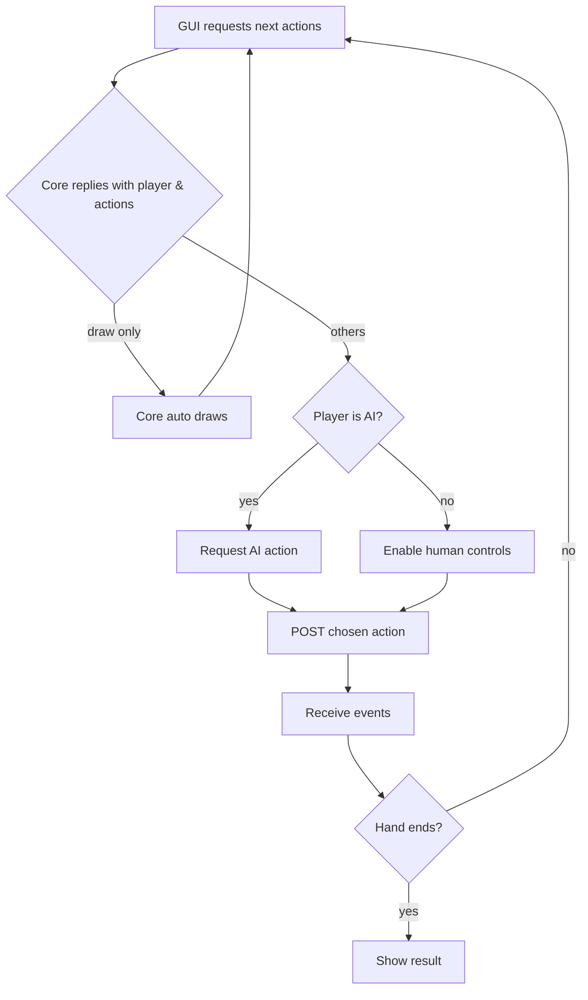

# MyMahjong

MyMahjong is a simple TypeScript monorepo for experimenting with a Mahjong game engine and related tooling.  The repository is intentionally small so the entire system can be understood at a glance.  It contains three packages:

- **core** – the game logic such as tiles, players and wall implementation
- **cli** – a command line interface for playing the game in the terminal
- **web** – a minimal web layer that demonstrates using the core package

## Implementation status

The repository currently includes initial engine modules in the **core**
package along with a minimal **cli**, **web** server and **web_gui**.
Future work will expand these components.

### Packages

 - [x] core
 - [x] cli
 - [x] web
 - [x] web_gui

### Features

 - [ ] External AI integration
 - [x] External AI backend integration design
- [x] MJAI protocol support
- [x] Basic MJAI event serialization
- [x] GameState JSON serialization
- [x] Tenhou.net/6 log export ([format described](docs/tenhou-json.md))
- [x] Copy Tenhou log after each hand
- [x] Convert MJAI logs to Tenhou format
- [ ] Full Tenhou log features (meld notation, yaku info)
- [x] RuleSet interface for scoring
- [x] Local single-player play via CLI
- [x] Basic remote game creation via CLI
- [x] Join remote games via CLI
- [x] Draw tile in remote games via CLI
- [x] View remote game state via CLI
- [x] Display player hand shanten via CLI
- [x] Remote server health check via CLI
- [x] REST + WebSocket API
- [x] Basic REST endpoints (create game, fetch game, health)
- [x] Web GUI served through GitHub Pages
- [x] Basic GUI status display
- [x] GUI server selection and retry
- [x] React front-end skeleton
- [x] Basic board layout with player panels
- [x] Hand & River components
- [x] Meld area component
- [x] Center display (dora & wall count)
- [x] Display honba & riichi stick counts
- [x] Show current round (e.g. 東1局) next to honba count
- [x] Meld display from game state
- [x] Melds positioned to the right of the player's hand
- [x] Called tile rotated within melds
- [x] Tile image rendering in GUI with alt text
- [x] Adjustable tile font size (default 1.5x)
- [x] Peek at opponents' hands option
- [x] Riipai (sort hand) button in GUI (enabled by default and used in Practice and Shanten Quiz)
- [x] Accessible tile buttons with aria-labels
- [x] Basic draw control via REST API
- [x] Automatic draw on turn start
- [x] Discard tiles via GUI
- [x] Display hand shanten count via GUI
- [x] Allowed actions API
- [x] Combined allowed actions endpoint
- [x] Allowed actions pushed via WebSocket events
- [x] Next actions API
- [x] Next actions logged to event history
- [x] GUI fetches next actions after every event
- [x] GUI follows next actions from core
- [x] Meld and win actions via GUI
- [x] Start game via GUI
- [x] Start round via API
- [x] Simple shanten-based AI for automated turns (discards tiles that keep shanten and calls pon/chi when it improves the hand)
- [x] Toggle AI per player from GUI
- [x] Configurable AI delay in GUI
- [x] AI type selection framework (currently only 'simple')
- [x] Players 2-4 use AI by default in GUI
- [x] Handle start_kyoku event in GUI
- [x] Join game by ID via GUI
- [x] Reconnect to running game after reload
- [x] Remember server URL and last game ID
- [x] Continuous integration workflow
- [x] Pinned Python dependencies for consistent CI
- [x] Web GUI unit tests
- [x] Core <-> interface API documented
- [x] GUI design documented
- [x] Corrected seat orientation (shimocha right side)
- [x] Stylish form inputs with Bulma CSS
- [x] Responsive layout for narrow screens
- [x] Icon buttons using react-icons
- [x] Compact header layout with gear icon options
- [x] Human/robot icons for AI toggle
- [x] Icon tooltips for peek and sort toggles
- [x] Favicon with mahjong emoji
- [x] Highlight active player on board
- [x] Different color when waiting on calls
- [x] 6x4 discard grid rendering
- [x] Modal error display on failed discard actions
- [x] Server-side action validation
- [x] Setup controls hidden after game start with modal access
- [x] Detailed event log display
- [x] Copy event log to clipboard
- [x] MJAI JSON shown alongside log entries
- [x] Event log modal with copy button
- [x] Debug logging of GUI API calls
- [x] Error modal shows server rejection
- [x] Chi option modal when multiple chi choices are available
- [x] Cancel in-flight allowed actions requests
- [x] Cancel in-flight next actions requests
- [x] Download Tenhou log
- [x] Download MJAI log
- [x] Log access from result modal
- [x] 何切る問題 mode
  - [x] CLI practice command
  - [x] AI recommendation
  - [x] Web UI support
- [x] シャンテン数クイズ
  - [x] CLI quiz command
  - [x] Web UI support

### Core engine capabilities

 - [x] start_game
 - [x] deal_initial_hands
- [x] draw_tile
- [x] discard_tile
- [x] get_state
- [x] scoring
- [x] call_chi
- [x] call_pon
- [x] call_kan
- [x] declare_tsumo
- [x] declare_ron
- [x] declare_riichi
- [x] riichi action discards and declares in one step
- [x] skip
- [x] end_game
- [x] start_kyoku
- [x] ryukyoku detection
- [x] Noten penalty scoring on draws
- [x] Draw result modal in GUI
- [x] Win result modal in GUI
- [x] End game result modal with final scores
- [x] standard wall initialization
- [x] dead wall & dora indicator tracking
- [x] wanpai separation and yama remaining count
- [x] configurable ruleset
- [x] detailed event log (player actions and backend responses)
- [x] current player tracking
- [x] Wait for all players to skip before next draw
- [x] `claims_closed` event emitted when the claim window ends
- [x] `round_end` event emitted between hands
- [x] Game ends early if any player reaches zero or negative points (bankruptcy)
- [x] Enforce tsumogiri after riichi
- [x] Riichi event includes player score and stick count
- [x] Ippatsu flag tracking for riichi wins
- [x] Validate closed-hand tenpai requirement for riichi
 - [x] action dispatch helper
  - [x] seat wind tracking
  - [x] Seat wind shown beside each player name in the GUI

## Game mode turn flow

The core engine and React GUI coordinate each turn through a simple request/
response cycle. The sequence is:



## Implementation plan progress

- [x] **1. Create the game engine** – wrap the Python `mahjong` library and expose
  methods for drawing, discarding and scoring.
- [ ] **2. Integrate external AI** – add a module that uses the
  [MJAI high level API](https://mjai.app/docs/highlevel-api) to communicate with
  the AI process and execute its moves.
- [x] **3. Build CLI** – provide commands for starting a local game against the AI and
  for connecting to remote games.
- [x] **4. Implement FastAPI server** – expose REST endpoints and prepare a WebSocket
  channel for real-time play.
- [x] **5. Develop React front-end** – consume the API and present a board based on the
  `docs/board-layout.md` design.
- [x] **6. Implement MJAI adapter** – translate game state to and from
  `docs/mjai-ai-integration.md` so AI engines can connect via the protocol.
- [x] **7. Set up GitHub Actions** – lint, type check, run tests and deploy the built
  web front-end to GitHub Pages.
- [x] **8. Add action endpoints** – implement `POST /games/{id}/action` for draw,
  discard, meld calls and win declarations.
- [x] **9. Stream events via WebSocket** – create `/ws/{id}` to push engine events so
  the GUI updates instantly.
 - [x] **10. Connect GUI state** – update React components to fetch the initial game,
  handle WebSocket events and send player actions.
 - [ ] **11. Provide a mock AI** – run a simple MJAI-compatible process through the
  adapter with an interface that later swaps in a stronger engine. A minimal
  tsumogiri AI exists for local automation.
- [ ] **12. Write end-to-end tests** – cover REST routes, WebSocket updates and basic
  GUI interactions.
 - [x] **13. Add `何切る問題` mode** – offer a practice scenario with a random seat wind
  and dora where the user picks a discard and the AI suggests a move.

### Remaining tasks

The following plan steps are not yet implemented:

- Step 2 – Integrate external AI.
- Step 8 – Add full action endpoints.
- Step 11 – Provide a mock AI.
- Step 12 – Write end-to-end tests.

### Core engine missing features

The core package covers the basic turn flow but several important capabilities
remain to be built:

- [x] Closed and added kan support with replacement draws and new dora
  indicators.
- [x] Tracking honba and riichi sticks in `GameState`.
- [x] Automatic round progression with dealer repeats and hanchan end
  detection.
 - [x] Exhaustive draw conditions: four kans, nine terminals, four riichi, and four winds detection.
 - [ ] Chankan ron on kan declarations.
- [x] Automatic round progression with dealer repeats and configurable round
  limit (east-only or hanchan).
- [x] Exhaustive draw conditions: four kans and nine terminals detection.
- [ ] Chankan ron on kan declarations.
- [ ] Exhaustive draw condition: four riichi.
- [ ] Complete MJAI protocol adapter for external AIs.
- [ ] External AI integration using the adapter.

See `docs/core-tasks.md` for detailed task descriptions.

See `docs/detailed-design.md` for an overview of the planned architecture.
`docs/web-gui-architecture.md` provides more details about the planned React GUI.
`docs/kyoku-flow.md` illustrates the flow of a single hand and the corresponding engine methods.

## 何切る問題 mode

This practice mode presents a what-to-discard problem to the player.
It is available via the CLI and the API.

Run the CLI version with:

```bash
python -m cli.main practice
```

### Current workflow

1. Randomly choose the seat wind and dora indicator.
2. Assume it is the dealer's first turn with no prior actions.
3. Display the hand and let the user select a discard.
4. The AI computes its recommended discard using a basic shanten heuristic.
5. Show the AI suggestion to the user for comparison.

Two API endpoints are provided:

- `GET /practice` returns a new problem.
- `POST /practice/suggest` returns the AI's suggested discard.

## Shanten quiz

This quiz shows a random hand and asks for the shanten number.
Run it with:

```bash
python -m cli.main shanten-quiz
```

1. Generate a 13-tile starting hand.
2. Display the tiles in short form.
3. Prompt for the shanten number and reveal the answer.

## Running locally

### Start the FastAPI server

The API server depends on the **core** package. Install the [**uv**](https://github.com/astral-sh/uv) tool and use it to install the editable packages before running `uvicorn`:

```bash
curl -Ls https://astral.sh/uv/install.sh | sh
uv pip install -e ./core -e ./web
uvicorn web.server:app --reload
```

If `uvicorn` prints "Unsupported upgrade request" or
"No supported WebSocket library detected" when starting, ensure the server was
installed with WebSocket support. Installing the **web** package as shown above
or running `pip install 'uvicorn[standard]'` will include the required
`websockets` dependency.

### Start the web GUI

The front-end is a small React app built with Vite. Start the development server
from the `web_gui` directory:

```bash
cd web_gui
npm install
npx vite --open
```

#### Event log

Each message from the server appears in the Events sidebar with a short
description followed by the exact MJAI JSON for that event. When all
players pass on a discard, the server emits a `claims_closed` event.
The log displays this as "捨て牌に対するアクションはありませんでした" to indicate
the claim window closed without a call.

### Start both together

You can launch the FastAPI server and the React GUI at the same time using
`run_local.py`:

```bash
python run_local.py
```

### Build and test

Install the editable packages and run all checks with **uv**. This mirrors the
GitHub Actions workflow so results are consistent locally and in CI:

```bash
uv pip install -e ./core -e ./cli -e ./web
uv pip install flake8 mypy pytest build
python -m build core
python -m build cli
flake8  # uses a very lenient rule set (E9,F63,F7,F82 only)
mypy core web cli
pytest -q
npm ci --prefix web_gui
# run Vitest from the web_gui directory so the React plugin is loaded
(cd web_gui && npx --no-install vitest run)
```

The GUI will automatically connect to the local FastAPI server's REST endpoints.

## Deployed to

The static web GUI in the `web_gui` directory is built and deployed via GitHub Pages:

https://kotarotanabe.github.io/MyMahjong/

The Vite configuration sets `base: '/MyMahjong/'` so asset URLs resolve correctly when
served from this subpath.

## Continuous Integration

GitHub Actions run linting, type checking, build and tests for every pull request
using **uv** to install dependencies. Once these checks succeed, the workflow
automatically approves and merges the PR.
The flake8 step runs with only the `E9`, `F63`, `F7` and `F82` checks enabled to
avoid excessive style warnings.
To prevent version drift between CI and local development, all Python
dependencies are frozen in `requirements.lock` which the workflow installs
with `uv pip install --system -r requirements.lock`. The lock file pins exact
package versions and references local packages via relative paths like
`-e ./core` so it can be used on any machine.
CI uses Python 3.11 and Node.js 20. Running the commands above with the same
versions locally ensures consistent results.
